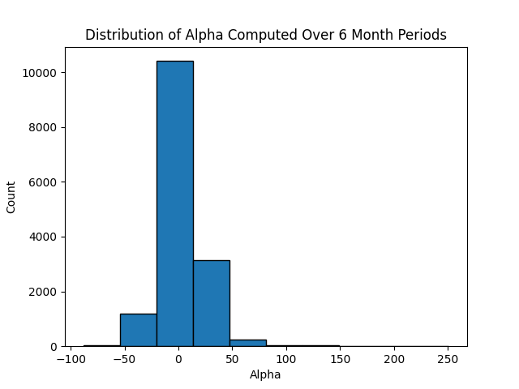
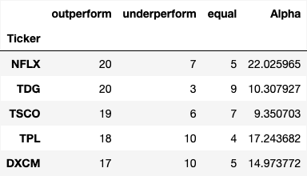
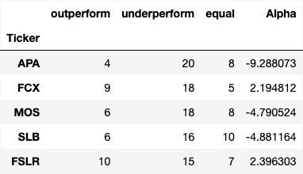
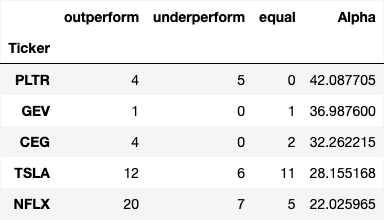
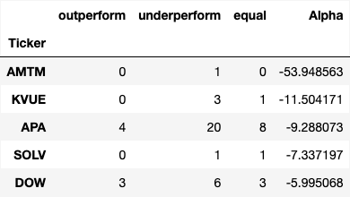
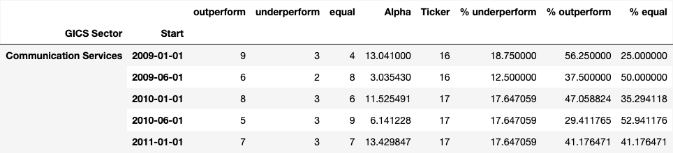
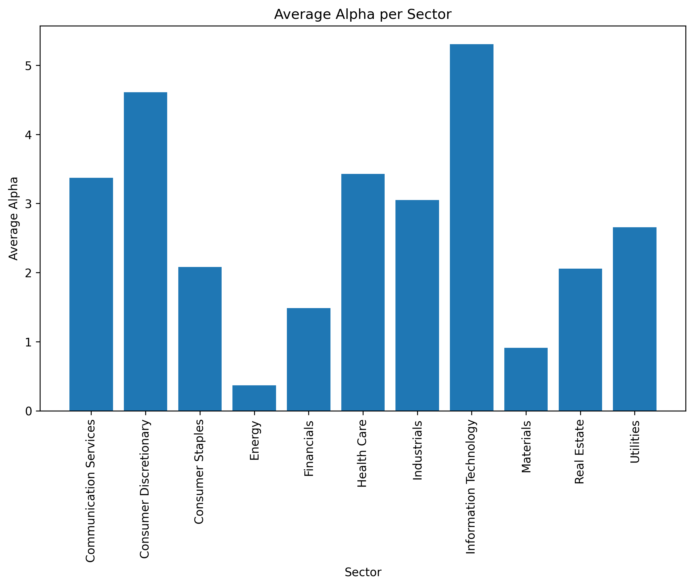
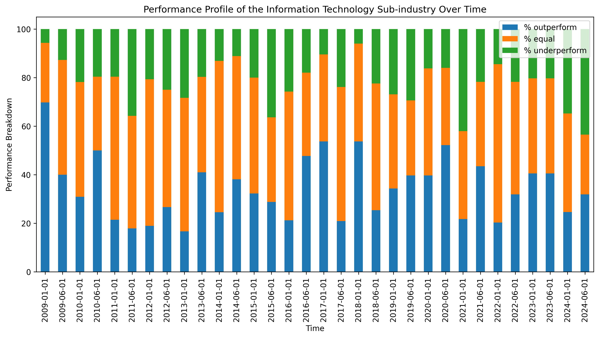
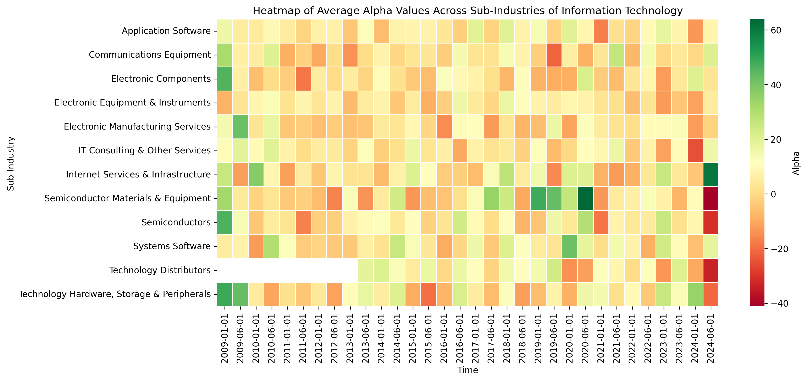

By Iris Maria Apostolopoulos
January 2025
# Introduction

## Our Goal 

The goal of this analysis is to show an example of how python, pandas dataframes, and matplotlib can be used to collect, analyze, and visualize data that captures historical stock performance. To evaluate the stock performance, we use the popular Alpha and Beta metrics. 

In the following report, we will define Alpha and Beta, show how to collect data from various sources to compute it for the stocks in the S&P 500 and show numerous examples of how to visualize the data. We will provide many examples of sample code in following sections, and the full code can be found here: https://github.com/IrisApo13/stock-alpha.

## What is Alpha and Beta? 

As stated by [Investopedia](https://www.investopedia.com/terms/a/alpha.asp), “Alpha (α) is a term used in investing to describe an investment strategy’s ability to beat the market, or its ‘edge.’ … Alpha, often considered the active return on an investment, gauges the performance of an investment against a market index or benchmark that is considered to represent the market’s movement as a whole.” The greater a positive Alpha value is, the more the stock outperformed the benchmark, while a greater negative Alpha indicates the stock did worse than the benchmark (adjusted for its risk level). This type of Alpha is often called [Jensens Measure](https://www.investopedia.com/terms/j/jensensmeasure.asp). Most often, Alpha is reported as a percentage; for example, an Alpha of 5 means the stock outperformed the benchmark by 5%. 

To calculate the Alpha of a certain stock, its volatility needs to be accounted for, represented by the metric Beta. According to **[Investopedia](https://www.investopedia.com/terms/b/beta.asp)**, Beta is “used in finance to denote the volatility or systematic risk of a security or portfolio compared to the market, usually the S&P 500 which has a Beta of 1.0.” If a stock has a Beta greater than 1, it is more volatile than the market, while a having a Beta lower than 1 means the stock is less volatile than the market. The ways to interpret the Beta value are shown below:

- A stock with a Beta of 0.5 would move half as much as the market
- If a stock has a Beta of 1.5, and the market moves 1.0%, the stock would move 1.5%

Alpha was chosen as a suitable and interesting metric to analyze, because instead of just capturing how the individual stock performs, it compares a stock's performance to the overall benchmark, allowing us to observe how the stock did relative to the general stock market. Alpha also takes into account the systematic risk of a stock (Beta), an aspect which other metrics fail to account for.

## How to calculate Alpha

Alpha is calculated using the below formula:

$$ Alpha = R - Rf - Beta (Rm - Rf) $$

Where:
* **R** represents the stock return: This was calculated by finding the difference between the stocks beginning value (at the start of the 6 month period) and the stocks ending value (at the end of the 6 month period), and dividing that value by the stocks beginning value. By finally multiplying this output by 100, we obtain the stocks return over the 6 month period in a percentage form. The individual stock data was downloaded from Yahoo Finance.
* **Rf** represents the risk free rate of return: The risk free rate of return, defined as  “the theoretical rate of return of an investment with zero risk” by [Investopedia](https://www.investopedia.com/terms/r/risk-freerate.asp), was represented by the 3 Month Treasury Bill Secondary Market Rate. This benchmark is widely used in financial analysis, including models like the Capital Asset Pricing Model (CAPM). The 3 Month Treasury Bill Secondary Market Rate was downloaded from the FRED database for a certain period.
* **Beta** represents the systematic risk of a portfolio: This was calculated by running a linear regression between the stock returns and market returns in a certain period. 
* **Rm** represents the market return per a benchmark: The S&P 500 data was also downloaded from yahoo finance, and we calculated it the same way as calculated the stock return.

It is important to notice how Beta affects the calculation of Alpha. While an Alpha of 1.0 would represent the stock outperforming the benchmark by 1%, the calculation is risk adjusted. To illustrate how important Beta is in determining the final Alpha value of a stock, we take NVDA in the first half of 2023 as an example:

As stated by [The Motley Fool](https://www.fool.com/investing/2024/01/10/why-nvidia-stock-skyrocketed-239-in-2023/), "According to data from [S&P Global Market Intelligence](https://www.spglobal.com/marketintelligence/en/index), the stock (NVDA) finished 2023 up 239% ... Most of those gains came in the first half of the year as the fervor over generative AI reached a fever pitch." However, as per our calculations, the Alpha value for the company in the first half of 2023 was only 160 (meaning it outperformed the benchmark by 160% - for context, the S&P 500 rose approximately 24% over 2023.) During this time period, however, Nvidia's Beta value was also high at 2.18. Having a Beta of 2.18 means the stock was volatile, and because the Beta factor in the Alpha equation was high, the final Alpha value was reduced.

It is important to keep in mind, that Alpha is a measure of how a stock performs compared to a benchmark (the S&P 500 in our case) and not a measure of stock price change. It is quite possible that a stock may have a high Alpha, even if it dropped in absolute price, if that drop was less than the drop of the benchmark. In other words, a positive Alpha can still mean the stock performed less bad that the benchmark. This is why, in practice, Alpha is used as a metric to evaluate the ability of portfolio or stock managers to outperform the market. 
## Data collection

We calculated the Alpha of the 500 stocks in the S&P 500 over a 15 year time period (January of 2009 to December of 2024), in time increments of 6 months. To calculate the Alpha, we needed (1) data for the risk free rate of return at a certain time period, (2) historical stock data for the 500 stocks in the S&P 500, and (3) a list of all the stocks contained in the S&P 500 and their sectors and sub industries. 

First, we downloaded a file from **[GitHub](https://github.com/datasets/s-and-p-500-companies/blob/main/data/constituents.csv)** containing the ticker of all the stocks in the S&P 500 and their individual sectors and sub industries. The stock tickers found in the downloaded data served as a reference list for the Alpha calculations we needed to perform, while the industry and sub industry attribution to each ticker was useful in the comparison analysis later on. 

Second, by navigating the Federal Reserve Economic Data ([Fred](https://fred.stlouisfed.org/)) site, a database which contains economic data from numerous sources, we obtained an API key that was used directly in the code. We could then directly download the “Three month Treasury bill secondary market rate” ([TB3MS](https://fred.stlouisfed.org/series/TB3MS)), representative of the risk free rate of return, and use it in the calculation of Alpha. Because the FRED data came in time increments of 1 month, we additionally needed to calculate the mean of the “Three month Treasury bill secondary market rate” per 6 month time period to directly use. 

Lastly, we downloaded the historical stock price data for each of the stocks (and the index) from [Yahoo Finance](https://help.yahoo.com/kb/SLN2311.html), which included metrics like opening price, closing price, adjusted close, high, low, and volume of a stock for the selected time period. This data allowed us to calculate the stock return and market return used in the calculation of Alpha. Because some of the companies went public after 2009, some tickers do not have the full set of historical data like older companies. 

## Calculating Alpha

We created a function in the code to calculate Alpha given the ticker, start of the 6 month period, and end of the 6 month period. This was used continuously, as we called the function for every stock in the S&P 500 for each of the time periods. The function returns an Alpha value which is meant to be interpreted as a percentage (eg: it returns an Alpha of 200, meant to be interpreted as the stock outperformed the market by 200%). Below is the code for the function: 

```# function to compute the Alpha of a specific stock and period of time
# function to compute the alpha of a specific stock and period of time
# stock_ticker: stock to compute alpha for 
# start_date: staring date for the period
# end_date: ending date for the period
# 
# Returns
# - true if we had enough data to compute alpha  
# - alpha 
# - beta

def alphabeta(stock_ticker, start_date, end_date):
    # get the stock price data for the interval
    stock_data = get_stock_data_for_period(stock_ticker, 
    start_date=start_date, end_date=end_date)

    # get the index price data for the interval 
    market_ticker = "^GSPC"
    market_data = get_stock_data_for_period(market_ticker, 
    start_date=start_date, end_date=end_date)

    # return here if we do not have stock data for this period, the stock may 
    # have not existed back then
    if stock_data.empty:
        return False, 0, 0

    # compute percent change of the stock price for the time period 
    stock_beggining_value = stock_data.head(1)['Adj Close'].values[0]
    stock_end_value = stock_data.tail(1)['Adj Close'].values[0]
    stock_overall_change = 
    ((stock_end_value - stock_beggining_value)/stock_beggining_value)*100

    # compute percent change of the index price for the time period
    market_beggining_value = market_data.head(1)['Adj Close'].values[0]
    market_end_value = market_data.tail(1)['Adj Close'].values[0]
    market_overall_change = 
    ((market_end_value - market_beggining_value)/market_beggining_value)*100

    # compute the beta as the intercept of the linear regression 
    # between the stock prices and the index 
    stock_data['close_diff_stock'] = 
    stock_data['Adj Close'].pct_change().dropna()
    market_data['close_diff_market'] = 
    market_data['Adj Close'].pct_change().dropna()
    aligned_data = pd.merge(stock_data, market_data, 
    on = "Date", how="inner").dropna() # sort_index().dropna()
    beta, intercept, r_value, p_value, std_err = 
    linregress(aligned_data['close_diff_market'], 
    aligned_data['close_diff_stock'])

    # compute the avg risk free rate for the period 
    tb3ms = get_fred_data_for_period(start=start_date, end=end_date)
    risk_free_rate = tb3ms['Value'].mean()
    
    # compute alpha
    alpha = stock_overall_change - 
    (risk_free_rate + (beta*(market_overall_change - risk_free_rate)))
    return True, alpha, beta
```
## Dataset
After collecting and processing the data, we end up with a table with 15,081 rows, each row corresponding to a 6 month period for a specific stock and containing the Alpha and Beta values as well as the sector information. 

An example of this data is shown below:


We expanded this information by adding 3 new columns that display if a particular stock underperformed, outperformed or stayed relatively the same in a certain 6 month period by checking if the Alpha exceeded a threshold. The threshold used was as follows*: 

- If a stocks Alpha exceeded 10, it was considered "over performing" for the period
- If a stocks Alpha was less than -10, it was considered as "under performing" for the period
- Otherwise, the performance of the stock was marked as "equal" (considered about equal to the benchmarks performance.)

\*This is an example threshold used for the project, and it is simple to change it in the code and repeat the analysis with a different one. 


# Data Exploration
## Stock level analysis
In this section, we will explore the Alpha and Beta values of specific stocks, independent of their sector.
### Per period analysis
Here we explore the Alpha and Beta values of stocks in individual 6 month periods. This allows us to plot distributions as shown in the graphs below, and discover outlier stocks which had extreme Alphas in a certain period.  

The above histogram shows the distribution of Beta for all the stocks and time periods. 

The figure above displays the distribution of Alpha for the companies contained in the S&P 500 over all the 6 month periods analyzed from 2009 to 2024. On the graph, the majority of the stocks did not perform vastly differently from the benchmark, and thus their Alphas were roughly 0. However, there were a couple notable outlier stocks in certain periods, which are explained below. 

Outlier stocks with the highest Alpha values include:

* **Tesla (TSLA)** with an Alpha of 251 in the second half of 2020 (2020-06-01 to 2021-01-01)
   * Tesla was the top stock in the S&P 500 with a return of 743.1% over the 2020 year. The company did particularly well in the second half of 2020 due to strong sales and expanded production, a stock split in August making the stock more accessible to individual investors, and increasing momentum in the EV industry. Additionally, it was introduced to the index in the final 4 months of the year, compelling funds tracking the index to purchase Tesla stock, further boosting the stock price. These are strong reasons as to why Tesla had such a high alpha value in this period. ([CNBC](https://www.cnbc.com/2020/12/31/here-are-the-top-performing-stocks-in-the-sp-500-for-2020.html))
* **Moderna Inc. (MRNA)** with an Alpha of 222 in the first half of 2020 (2020-01-01 to 2020-06-01)
   * Moderna Inc. played a pivotal role in the early production of Covid-19 vaccines, and the company's stock did exceptionally well in the beginning of the pandemic due to government support, a global demand for Covid-19 vaccines, as well as positive early clinical trial results. These factors boosted investor optimism and the stock grew 757.3% in 2020, significantly greater than the S&P 500s total return of 20.2%. ([Investopedia](https://www.investopedia.com/moderna-q4-2020-earnings-5113673))
* **Palantir Technologies (PLTR)** with an Alpha of 216 in the second half of 2024 (2024-06-01 to 2024-12-24)
   * Palantir Technologies stock surged in late 2024 due to a combination of factors, including AI demands, stronger-than-expected quarterly earnings, and results of the U.S. elections. PLTR was the 2024 top performing stock in the S&P 500, with gains exceeding 340% as of the end of the year. ([Forbes](https://www.forbes.com/sites/greatspeculations/2024/12/30/palantir-stock-went-45x-this-year-time-to-rethink/))

Outlier stocks with the lowest Alpha values include:

* **Moderna Inc. (MRNA)**, with an Alpha of -88 in the second half of 2024 (2024-06-01 to 2024-12-24)
   * Contrasting to its growth in early 2020, Moderna Inc. stock performed significantly worse than the S&P 500 in the second half of the 2024, likely due to a reduced demand for its Covid-19 vaccines, research and development budget cuts, and a competitive respiratory vaccine market. MRNA is an interesting example of a company that both out performed and under performed the index in the span of just a couple years. ([Yahoo Finance](https://finance.yahoo.com/news/moderna-stock-down-39-three-130300706.html))
* **Builders FirstSource Inc. (BLDR)**, with an Alpha of -84 in the second half of 2010 (2010-06-01 to 2011-01-01)
   * Builder FirstSource Inc., a manufacturer and supplier of building materials mainly to professional homeowners, faced a significant decline in stock value in late 2010. This can be attributed to the reduced demand of housing construction materials as the housing market struggled to recover from the 2008 financial crisis, and company operational challenges. ([NBC News](https://www.nbcnews.com/id/wbna39787457))
* **Advanced Micro Devices Inc. (AMD)**, with an Alpha of -84 in the second half of 2012 (2012-06-01 to 2013-01-01)
   * In late 2012, Advanced Micro Devices Inc. faced several challenges which contributed to its stock price decline, including an underperforming product release (AMD’s Bulldozer microarchitecture), financial losses, and the declining PC market reducing demand for AMD’s processors. AMD stock price declined 58% over the 2012 second 6 month period where the S&P 500 contrastingly rose 0.9%. The company's underperformance is directly reflected in the Alpha value. ([Forbes](https://www.forbes.com/sites/greatspeculations/2012/11/30/why-amds-stock-collapsed-and-how-it-can-recover/))


`

The above figure displays the growth or decline in the Alpha values of three example stocks -Nvidia, Apple, and Moderna Inc.- over six-month intervals. The horizontal red line at 0 represents the S&P 500's performance. Noticeably, the Alpha values vary drastically from period to period; for example, MRNA hit an obvious peak in the 2020-01-01 period and yet dipped immediately in the following period. Similarly, NVDA's Alpha values have undergone significant fluctuations, especially in recent periods starting in 2022. While all of the stocks Alphas values have dipped below 0 more than once (displaying a stocks underperformance in comparison to the S&P 500), MRNAs Alpha value dropped nearly to -85 in the second half of 2024, due to a lack of demand for the companies products. Additionally, MRNA's Alpha value history starts in 2018 rather than 2009 like the other two stocks, due to the company going public in December of 2018. 

It is interesting to notice how real world events can be seen through the fluctuating Alpha values. Events like the recent AI bubble and COVID greatly impacted many stocks, which can be seen by the sudden spike in Alpha for MRNA during covid, and the spikes in NVDA stock recently. 
### Over time analysis
Here we explore the overall performance of stocks over the whole 15 year period.  To do this, we need to come up with a way to represent the performance of a stock over this time. We used two methods for this: counting the number of periods where a stock over-performed and calculating the average Alpha of each stock. Each method provides a different way to look at the overall stock performance. 


In the figure above, the 5 stocks with the most outperformance periods over the evaluation period were NFLX, TDG, TSCO, TPL, and DXCM.



The stocks with the most underperformance periods were APA, FCX, MOS, SLB, and FSLR. 

The above method gives us an idea of the best and worse performing stocks, but it fails to tell us how all the stocks did; a better way to capture this is the distribution of over and under performing period, shown in the below graphs. 

The above graph shows that the majority of stocks had about 9 over-performing periods.

In the above graph, the majority of stocks had around 7 underperforming periods over the past 15 years. 

While the number of over performing periods a stock had was interesting to look at, it may not be a good indicator of how “well” a stock did in comparison to the benchmark over time, as an average Alpha more accurately represents how it did over the 15 years. It is also important to note that the stocks with the most over performing periods did not have the highest average Alpha and vice versa. 


The stocks with the highest average Alpha over the 15 year period were PLTR, GEV, CEG, TSLA, and NFLX. It is interesting to note that although the above listed stocks have high average Alpha values, they do not all have many outperforming periods (except for Netflix). For example, PLTR has the highest average Alpha and yet more underperforming periods than outperforming periods.  



The stocks with the lowest average Alphas were ANTM, KVUE, APA, SOLV, and DOW. Many of the worst performing stocks listed above have been in the market for only a couple periods, and are noticeably already performing badly (except for APA). 

The above graph displays the distribution of a stocks average Alpha computed over the whole 15 year period. 

## Sector Level Analysis
In this section, we will analyze the sectors of the S&P 500. The S&P 500 contains 11 sectors: information technology, financials, health care, consumer discretionary, communication services, industrials, consumer staples, energy, real estate, materials, and utilities. Below is a simple table containing the sector and how many companies are contained in it (represented by the "Symbol" column).


We want to compare sectors using the metric from the previous section, namely the count of over and under performing periods and the average Alpha value. Each sector contains multiple stocks, so even for a specific 6 month period, we have to aggregate the over and under performance counts. Because different sectors contain a different number of companies, if we simply added the number of over and under performing periods, we would end up favoring large sectors since they have more companies. Instead, we compute the fraction of the sector's stocks that over and under performed in each 6 month period. Below is an example of how our data looks after this calculation. The "ticker" column is the number of stocks per sector in the time period.  



### Over and Underperforming periods
Because we calculated data which contains information for each of the 30 6 month periods for each sector, a heat map is a convenient method for visualizing this information. Heat maps are usually used to visualize two-dimensional data, where one dimension is time. 


The above graph shows the over performance for each sector and time period.  


The above graph shows the under performance of each sector for each time period. 

In the next two graphs, we also show the overall performance of each sector over the 15 year period. To calculate the overall over-performance and underperformance of a sector over time, we summed the count of over and underperforming stocks over all periods, and then divided it by the number of stocks in the sector multiplied by the number of periods. 


Finally, in the graph below, for each sector we show the breakdown into outperforming, underperforming and equal periods over the 15 year time. We chose to represent the data in a stacked bar chart like this because it is visually easy to compare between sectors.  


### Average Alpha
In addition to the over and under performing periods above, we repeated the same analysis using the average Alpha across all the stocks in the sector for each 6 month period. 


In the heat map above, we show the average Alpha of each industry for each 6 month period. The darker red a cell is, the lower the average Alpha for the period was, while the darker green a cell is the higher the average alpha was. Most cells in the heat map were a light shade of yellow, orange or green, displaying that most industries had around a 0 Alpha value in each time period. 


The bar graph above shows the average Alpha per sector. We computed the average Alpha for each sector over all time periods by averaging the average Alpha of each period. Noticeably, the information technology sector had the highest average Alpha, while consumer discretionary has the second highest. 

## Deep Dive in One Sector
Each S&P 500 sector is divided up into sub-industries; In this section, we will repeat the above analysis for two sectors, and examine the effects of global events on notable sub-industries. 
### Information Technology
Because Information Technology has been a rapidly growing sector in recent years, we chose to examine it in more detail.


The stacked bar chart above displays the performance breakdown of the Information Technology sub-industry over time.


The above heat-map shows the average Alpha value of each sub-industry in the Information Technology Sector for each 6 month period. 
Three outliers that visibly stood out on the heat-map were the severe under/over performance of the Internet Services & Infrastructure sector, and the Semiconductors Materials & Equipment sector in the second half of 2024. Notably, both sectors had very few stocks, allowing the sub- industries average Alpha to be moved easily. 


Referencing the "Information Services & Infrastructure" table above, AKAM and VRSN stocks both performed alike to the benchmark, whereas GDDY over-performed the S&P 500 slightly. However, PLTR drove the sub-industry to a high average Alpha, as the stock had an outlier Alpha of 216. Thus, because the sub-industry had only 4 stocks, one company (PLTR) managed to drive the sub-industry's average Alpha to a high value, although the other stocks did not perform particularly well. Palantir Technologies Inc.'s (PLTR) over-performance was largely attributed to the results of the U.S. election, and recent AI demands. 


The table above displays the Alphas of the stocks contained in the Semiconductors Material and Equipment subindustry, in the last half of 2024. All of the stocks underperformed, causing the sub-industries average Alpha to be the lowest displayed on the average Alphas heat-map. This was a surprising find because recently the AI industry has grown tremendously, and semiconductors are essential to artificial intelligence, providing the necessary processing power and efficiency. After looking more into the subindustry and individual stocks however, the subindustries underperformance can be attributed to a mix of geopolitical tensions, overvaluation concerns, and potential export restrictions. Additionally, Semiconductors Material and Equipment has recently been an extremely volatile subindustry, and because we calculated and compared the average alpha for a short time period (only a 6 month period), temporary volatility or corrections in the market could explain the unusual negative alpha.

### Energy
In the heat-map of average Alpha across industries in the "Average Alpha" section above, the energy sector had some of the highest and lowest average Alpha, so we wanted to examine it in more detail. 


The above heat-map displays the average Alpha values for each of the 5 sub-industries in the Energy Sector of the S&P 500, in a certain 6 month period. Interestingly, all of the sub-industries over-performed during the first half of 2022. In the 2022 year, the energy sector dominated the other sectors in performance, rising 50.6% as the S&P 500 fell approximately 19%. According to a [NasDaq](https://www.nasdaq.com/articles/2022-stock-market-recap%3A-what-a-crazy-year?utm_source=chatgpt.com) report on the S&P 500 in 2022,  "...following the West's sanctions on Russian energy, a domino effect unfolded, resulting in energy shortages and existing energy transportation routes crumbling. The result? Oil, gas, and coal prices skyrocketed! Oil majors and companies in the space (energy sector), in general, have been posting monster profits." These reasons can explain why the energy sector suddenly had a high average Alpha after a history of relatively modest Alpha values.

Additionally, the gas refining and marketing sub-industry severely underperformed in the second half of 2009. According to an article published by [Investopedia](https://www.investopedia.com/ask/answers/052715/how-did-financial-crisis-affect-oil-and-gas-sector.asp)covering the effects of the 2008 financial crisis on gas and oil, "The 2008 financial crisis and the [Great Recession](https://www.investopedia.com/terms/g/great-recession.asp) that followed had a pronounced negative impact on the oil and gas sector as it led to a steep decline in oil and gas prices and a [contraction](https://www.investopedia.com/terms/c/contraction.asp) in credit. The decline in prices resulted in falling revenues for oil and gas companies." This can explain why the gas refining and marketing subindustry severely underperformed in late 2009.

Many changes in the average Alpha of a subindustry can be explained, and it is interesting to take a look at how global events and crisis impact how a sub-industry performs in a particular time period. 

# Code
## Introduction
To do this project, we calculated the Alpha values for various stocks and produced necessary visuals to display our findings all using code. The coding language we used was Python 3.0, in a local Jupyter Notebook environment. We split up our code into two notebooks: one notebook was used first for downloading and processing the data, as well as calculating the Alpha and Beta of the stocks. The second notebook was used for our analysis, and contains all the code used to generate the visuals necessary throughout this report. The full code can be found on this GitHub page: https://github.com/IrisApo13/stock-alpha.

A **dataframe** is a 2 dimensional, labeled collection of data, and it has rows, columns and an index. Dataframes can be created from several sources, including lists, external files, or python dictionaries. They were very useful throughout the project as they allowed us to download stock data directly into a dataframe, making it easy to organize and access all the data we collected over the course of the project.

A **library** is a collection of pre-written code that programmers can use to perform specific tasks. Although we used many libraries throughout the code, a couple crucial ones are listed and explained below.

Libraries for the **dataset**:
- Yahoo finance (import yfinance as yf): 
	- Yfinance acts as a wrapper to fetch historical stock prices, financial data, and other market-related information from Yahoo Finance. 
	- yf.download is a function in the Yahoo Finance API wrapper library, typically used to download historical data from stocks. 
	- We used Yfinance to obtain historical financial data for all of the stocks in the S&P 500. We specified the starting and ending date (2009-01-01 and 2024-11-24), and called the "function" for every element in a list which contained all stocks in the S&P 500. The data was then saved into a pandas dataframe for further use. 
- SciPy (from scipy.stats import linregress): 
	- SciPy is a scientific computing library that provides functions for mathematics, statistics and optimization.
	- We imported the function linregress from the SciPy library, and this was used in the calculation of Beta. 
- Pandas (import pandas as pd):
	- Pandas is a powerful library designed for working with structured data. 
	- One key features of Pandas that we used continually throughout our code was the dataframe. We used dataframes to organize all the features of the stocks so we could easily access them. 

Libraries for the **analysis**:
- MatPlotLib Library (import matplotlib.pyplot as plt):
	- MatPlotLib is a popular python library used to create visuals, and is widely used for plotting graphs and visualizing data in 2D.
	- We used the function "plt.plot" continuously throughout our code to generate histograms and line graphs to display our data. 
- Seaborn Library (import seaborn as sns): 
	- Seaborn is built on top of MatPlotLib, and is specifically used for creating statistical graphics. It also works extremely well with pandas dataframes, allowing you to plot  without any extra transformations.  
	- We used Seaborn to plot heat maps in order to display our data in an easy to visualize way. 
	
## Dataset Code

One of the key parts of the project was calculating the Alpha and Beta for a stock. The code for the calculation was given in a section above. We built a loop to compute the Alpha and Beta values for each stock and time period using the code below:

```
# build 6 month time periods
years = [str(i) for i in range(2009,2025)]
intervals = []
for year in years:
    intervals.append(year+"-01-01")
    intervals.append(year+"-06-01")
intervals.append("2024-12-24")

# compute alpha and beta for all stocks and time periods 
# alphabeta is the function which given the ticker of a stock, 
# calculates the alpha and beta of it

stocks = list(tickers['Symbol'])

data = []

for stock in stocks:
    #print(stock, interval)
    for i in range(len(intervals)-1):
        worked, alpha,beta = alphabeta(stock, intervals[i], intervals[i+1])
        if worked:
            results = (stock, intervals[i], intervals[i+1], alpha, beta)
            data.append(results)
```
## Analysis Code

We used different types of graphs to convey different statistical information in an easier to see manner. For example, histograms were mainly used to show to show one-dimensional data, while the heat maps could visualize two-dimensional data, with one of the dimensions being time. Line graphs were also useful to show the difference in Alpha growth between several stocks. 
One of two libraries was used for plotting each graph: either the built-in Pandas data frame plotting feature, or MatPlotLib. Pandas plotting works well when quickly plotting information directly from a dataframe. For example, the simple command "df.plot.bar()" automatically formats a bar graph for you using the information already in the dataframe. However, MatPlotLib can provide more flexibility and advanced features to change. Most of our graphs were produced using MatPlotLib, but the built-in Pandas plotting proved useful for certain graphs and quickly visualizing data. Below, we highlight the code used to build 3 different and useful graphs produced from the data using different plotting methods. 

Below is an example of a basic **histogram** we created and used previously in this report to display the distribution of Alpha values for each 6 month period:

```
# combined_df: A datframe containing (most importantely) the ticker, 
# alpha, beta, sector and sub-indsutry of a 
# stock for every period (15081 rows in total) 

#creating the histogram
plt.hist(combined_df['Alpha'], bins=10, edgecolor='black')
plt.title('Distribution of 6 month period Alpha over past 15 years')
plt.xlabel('Alpha')
plt.ylabel('Count')

# saving the figure locally, and displaying it
plt.savefig("figures/overall_distribution.png") 
plt.show()
plt.close()
```
(Note: **MatPlotLib** was used)

Another helpful way to display a different kind of data is a **stacked bar chart**: each bar represents the total value (100% in this case), and its sectioned off into portions to show the contribution of each part to the total. This type of chart was useful to display what percent of the stocks in a sector underperformed, over-performed, or performed roughly the same as the index (in percentages). The code for one of the charts displaying the performance profiles for each sector over the 15 years is displayed below:

```
new_df = sector_total_stats_df.reset_index()
ax = new_df.plot.bar(x='GICS Sector', 
                             y=['% outperform', '% equal', '% underperform'], 
                             rot=90, 
                             title = "Performance profile over time",
                             xlabel = "GICS Sector",
                             ylabel = "Performance Breakdown",
                             stacked=True,
                             figsize=(13, 6))

plt.savefig("figures/sectors_profile.png", bbox_inches="tight", dpi=300) 
```
(Note: **Pandas Plotting** was used)

Below is the code used for creating a SeaBorn **heat-map** with the average Alpha of each industry for each 6-month period:

```
# Plotting a heatmap to represent the average alpha values 
# of each industry for each 6 month period

# Creating a new dataset - "heatmap_data" - with the average 
# alpha of each industry for all periods
heatmap_data = 
sector_stats_df.reset_index().pivot(index="GICS Sector", 
columns="Start", values="Alpha")

# Calculate the min and max alpha values for normalization
vmin = heatmap_data.min().min()  
vmax = heatmap_data.max().max()

# Create a normalizer with white centered at 0
norm = TwoSlopeNorm(vmin=vmin, vcenter=0, vmax=vmax)

# Creating the heatmap using seaborn plotting
plt.figure(figsize=(13, 6))
sns.heatmap(
    heatmap_data,
    annot=False,  # Show values in cells
    cmap="RdYlGn", # Color map
    linewidths=0.5,  # Add lines between cells
    cbar_kws={"label": "Alpha Value"},  # Label for color bar
    norm = norm,
)

# Labeling the axis' and customizing the heatmap further
plt.title("Heatmap of Average Alpha Values Across Industries and Time")
plt.xlabel("Time")
plt.ylabel("Industry")
plt.xticks(rotation=90)  # Rotate x-axis labels

# Saving and displaying the figure
plt.savefig("figures/alpha_heatmap.png", bbox_inches="tight", dpi=300) 
plt.show()
```
(Note: **SeaBorn** was used)

# Conclusion

In this analysis, we computed the Alpha and Beta metrics of all the stocks in the S&P 500 for the past 15 years, and used the information we calculated to compare our findings mainly using two metrics: the average Alpha of a time period, and the outperformance/underperformance periods. After we visualized the data in bar graphs, heat-maps, and line graphs, we could see some interesting trends, including the effect covid, the AI bubble, and the 2008 financial crisis had on certain industries. In a future project, we are looking to perform the same analysis for ETF's instead of individual stocks and sectors.